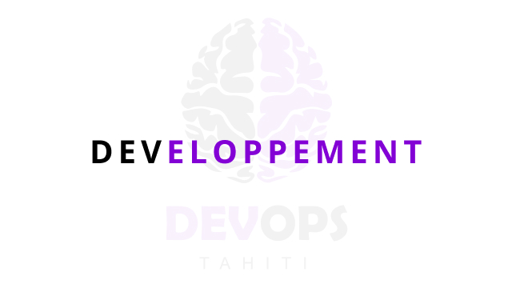
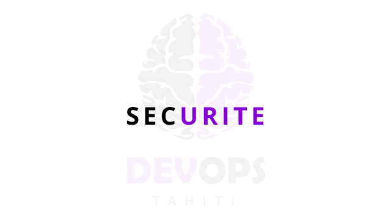
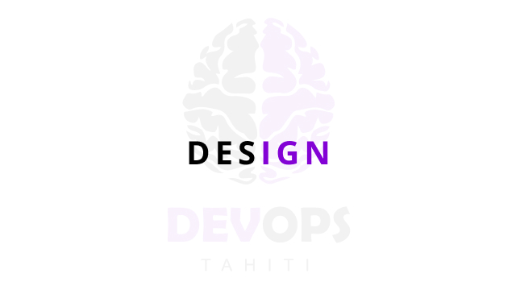
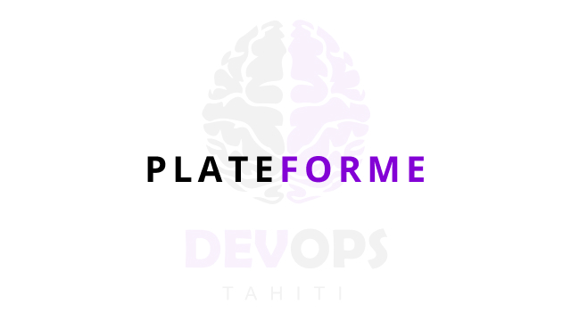
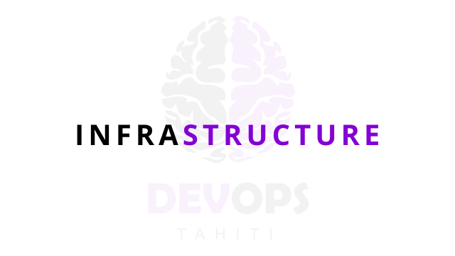
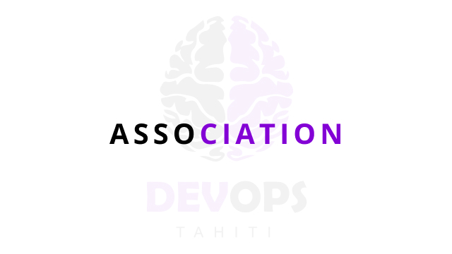

<!-- Section -->
<section>
    <header class="major">
        <h2>Nos valeurs</h2>
    </header>
    

        <article>
            
            

                <h3>La qualité</h3>
                
Toute la démarche consiste avant tout à répondre aux besoins de l'utilisateur. Tout le reste est ensuite question d'efficience. Nous gardons donc toujours en tête la question suivante: «en quoi est-ce que cela simplifie la vie de l'utilisateur de notre application ?».

            

        </article>
        <article>
            
            

                <h3>Le pragmatisme</h3>
                
Parce qu'il s'agit avant tout de produire, l'outil n'est que ça, un outil. Nous ne voulons donc pas utiliser une méthode de développement juste pour elle-même. Idem pour les librairies, frameworks, IDE et méthodes de gestion de projets (même si elles sont agiles).

            

        </article>
        <article>
            
            

                <h3>Intégration & livraison continue</h3>
                
Nous sommes (pour la plupart) intelligents mais faillibles. L'automatisation demande un travail de méta-réflexion. La machine exécutera tout ce qu'on lui demandera. À partir de ces trois axiomes, nous considérons l'intégration et la livraison comme des conditions nécessaires (mais non suffisantes) du devops.

            

        </article>
        <article>
            
            

                <h3>Data-driven decision</h3>
                
Le pilotage par la donnée a deux bénéfices immédiats: concevoir le produit en y intégrant les métriques de qualité et de performances et retirer l'ego de la prise de décision. Ouïne-Ouïne.

            

        </article>
    

</section>

<!-- Section -->
<section>
    <header class="major">
        <h2>Nos rencontres</h2>
    </header>
    

        <article>
            
            <h3>019 - 0 to hero en sécurité des resource-servers Spring</h3>
            <h4>Jérôme Wacongne</h4>
            

				Séance de travaux pratiques autour de la configuration et des tests d'API RESTful Spring sécurisées avec Keycloak.
            

            

                Seront abordés: 
                <ul>
                    <li>les cas "simples" de contrôle d'accès basé sur des rôles utilisateurs</li>
                    <li>l'ajout de données personnalisées (private-claims) aux tokens émis par Keycloak</li>
                    <li>l'exploitation des private-claims avec spring-security</li>
                </ul>
            

            

				Les participants sont priés de venir avec un ordinateur portable sur lequel seront installés <a href="https://github.com/graalvm/graalvm-ce-builds/releases/tag/vm-22.3.0">GraalVM Java 17</a>, Git et un IDE Java (<a href="https://spring.io/tools">STS</a>, <a href="https://code.visualstudio.com/download">VS code</a>, <a href="https://www.jetbrains.com/idea/download/">IntelliJ IDEA</a>, ...).
            

            

                <a href="https://github.com/ch4mpy/spring-addons/tree/master/samples/tutorials">Visualiser le code source</a>
            

            <ul class="actions">
                <li><a href="https://www.meetup.com/tahitidevops/events/289366069" class="button">jeudi 27 octobre 2022 à 17h dans les bureaux de Tahiti Coworking</a></li>
            </ul>
        </article>
        <article>
            
            <h3>018 - Identité et authentification avec Keycloak</h3>
            <h4>Jérôme Wacongne</h4>
            

				En se basant sur Keycloak, en utilisant le protocole OpenID Connect, Jérôme nous présentera un serveur web (Spring) et une application mobile (Ionic) permettant la gestion de commande de boisson dans un bar.
            

            

                OpenID Connect est le protocole d’authentification utilisé par FranceConnect et tous les géants du Web, Spring est le framework web Java le plus utilisé au monde et Ionic est un framework permettant de développer des applications multi-plateformes (et donc du mobile).
            

            

                <a href="/assets/pptx/OpenID-Meetup.pptx">Visualiser les slides</a>
                 
                <a href="https://github.com/ch4mpy/openid-meetup">Visualiser le code source</a>
            

            <ul class="actions">
                <li><a href="https://www.meetup.com/fr-FR/TahitiDevOps/events/271403487/" class="button">mercredi 04 novembre 2020</a></li>
            </ul>
        </article>
        <article>
            
            <h3>017 - Le chiffrement pour ceux qui n’y connaissent rien</h3>
            <h4>Peter Meuel</h4>
            

				Chiffrage, chiffrement, cryptage ... si ces 3 mots vous semblent identiques ou inconnus, cette présentation est pour vous. Cette présentation très grand public partira de la base, passera par quelques notions mathématiques, pour terminer sur une démo.
            

            

                <a href="/assets/pdfs/20200701_017_chiffrement.pdf">Visualiser les slides</a>
            

            <ul class="actions">
                <li><a href="https://www.meetup.com/fr-FR/TahitiDevOps/events/271403487/" class="button">mercredi 11 mars 2020</a></li>
            </ul>
        </article>
        <article>
            
            <h3>016 - Les tests (unitaires et autres), c'est bon pour la santé</h3>
            <h4>Paraita Wohler, Jérôme Wacongne, Jean-Francois Baillette, Christophe Villeneuve</h4>
            

				Les tests sont souvent relégués aux tâches secondaires, passant même après les demandes cosmétiques demandées par les clients. Ils n'ont à priori pas de valeur pour ces derniers et consomment de la ressource supplémentaire.
			

			

				Cette présentation va parler de quelques types de tests automatisés, à quoi ils servent et comment les écrire facilement.
            

            

                <a href="/assets/pdfs/20200603_16_tests.pdf">Visualiser les slides</a>
            

            <ul class="actions">
                <li><a href="https://www.meetup.com/fr-FR/TahitiDevOps/events/269143260/" class="button">mercredi 11 mars 2020</a></li>
            </ul>
        </article>
        <article>
            
            <h3>015 - Serverless Web Scrapping (Démo)</h3>
            <h4>Hubert LEVIEL</h4>
            

                Si le Web Polynésien regorge de données intéressantes, l'Open Data est encore rare voire inexistant.
                Le web scrapping est une technique d'extraction du contenu de sites Web.
                Hubert nous fera une démo basé sur Python en utilisant la bibliothèque Beautiful Soup, tournant sur AWS Lambda.
                [Tout le code est disponible dans ce dépôt github](https://github.com/HLeviel/meteoscrapper/)
            

            <ul class="actions">
                <li><a href="https://www.meetup.com/fr-FR/TahitiDevOps/events/269143156/" class="button">mercredi 11 mars 2020</a></li>
            </ul>
        </article>
        <article>
            
            <h3>014 - Le langage R</h3>
            <h4>Laurent PELLET</h4>
            
Au travers de ses fonctionnalités clés, nous montrerons comment R est en train de remplacer les solutions propriétaires et comment il s'impose comme une solution simplet et rapide pour qui veut maitriser la chaine complète d'analyse des données (connecteurs aux sources de données, fonctions d'analyse, temps de traitement, édition de rapport complexe et mise en ligne de rapport dynamiques).
            

            <ul class="actions">
                <li><a href="https://www.meetup.com/fr-FR/TahitiDevOps/events/265771502/" class="button">mercredi 20 novembre 2019</a></li>
            </ul>
        </article>
        <article>
            
            <h3>013 - DevSecOps</h3>
            <h4>Jean-Francois BAILLETTE</h4>
            
Une présentation autour des généralités du DevSecOps et bonnes pratiques, le DevSecOps pour 0€ selon OWASP avec une intervention depuis la France de Christophe VILLENEUVE sur la sécurité dans les extensions Firefox.
            

            

                <a href="https://www.g-echo.fr/20191107-DevSecOps">Visualiser les slides</a>
            

            <ul class="actions">
                <li><a href="https://www.meetup.com/fr-FR/TahitiDevOps/events/266268580/" class="button">jeudi 07 novembre 2019</a></li>
            </ul>
        </article>
        <article>
            
            <h3>012 - TLS/HTTPS : Au-delà du certificat X.509</h3>
            <h4>Romain TARTIÈRE</h4>
            

                Cette conférence se focalise sur les aspects techniques du déploiement de services basés sur TLS.
                Nous verrons quelles menaces doivent être prises en compte et quels dispositifs nous permettent de nous en prémunir.
            

            

                <a href="https://romain.blogreen.org/files/tls-https-au-dela-du-certificat-x-509.pdf">Télécharger les slides</a>
            

            <ul class="actions">
                <li><a href="https://www.meetup.com/fr-FR/TahitiDevOps/events/265173633/" class="button">mercredi 9 octobre 2019</a></li>
            </ul>
        </article>
        <article>
            
            <h3>011 - L’UXD: quoi, pourquoi, comment</h3>
            <h4>Fabrice FAUCHON</h4>
            

                L’UXD (User eXperiment Design) est une méthode pluridisciplinaire, proactive, pragmatique, innovante, évolutive et perturbante visant à améliorer l'expérience des usagers d'un service web ou d'un produit selon 4 grandes étapes itératives : Empathie -> Définition -> Idéation -> Prototypage -> Test.
            

            <ul class="actions">
                <li><a href="https://www.meetup.com/fr-FR/TahitiDevOps/events/254659117/" class="button">mercredi 5 décembre 2018</a></li>
            </ul>
        </article>
        <article>
            
            <h3>010 - CKAN - La plateforme de l'Open Data</h3>
            <h4>Hubert LEVIEL</h4>
            

                CKAN est un catalogue de données open source. Il est le moteur des plus gros portails gouvernementaux d'Open Data (US, UK, Canada, Europe, France, Suisse...).
                La Polynésie française s'engageant actuellement sur la voie de l'Open Data, nous étudions la pertinence d'utiliser CKAN comme future plateforme.
                Rejoins-nous pour une exploration technique de son architecture et une démonstration de son API.
            

            <ul class="actions">
                <li><a href="https://www.meetup.com/fr-FR/TahitiDevOps/events/254654895/" class="button">mercredi 7 novembre 2018</a></li>
            </ul>
        </article>
        <article>
            
            <h3>009 - Kubernetes 101</h3>
            <h4>Jonathan PIGRÉE</h4>
            

                Pas de blabla, de la démo comme on l’aime, Jonathan nous fera passer de n00b à (presque) expert sur Kubernetes (k8s).
                Scalabilité, workload, canary deployment, le programme sera varié.

                <ul class="actions">
                    <li><a href="https://www.meetup.com/fr-FR/TahitiDevOps/events/253868192/" class="button">mercredi 5 septembre 2018</a></li>
                </ul>
            </article>
            <article>
                
                <h3>008 - Qu'est-ce que la blockchain ?</h3>
                <h4>Peter MEUEL</h4>
                
Cette session commencera par une comparaison des moyens de réduire l'incertitude dans les pratiques du cycle en V, du design et du Lean Startup. Après cette introduction qui permettra de fixer le vocabulaire et de faire émerger des questions, Matti animera une discussion collaborative au format fishbowl.

                <ul class="actions">
                    <li><a href="https://www.meetup.com/fr-FR/TahitiDevOps/events/253082119/" class="button">mercredi 1er août 2018</a></li>
                </ul>
            </article>
            <article>
                
                <h3>007 - Lean & Agile</h3>
                <h4>Matti SCHNEIDER</h4>
                
Cette session commencera par une comparaison des moyens de réduire l'incertitude dans les pratiques du cycle en V, du design et du Lean Startup. Après cette introduction qui permettra de fixer le vocabulaire et de faire émerger des questions, Matti animera une discussion collaborative au format fishbowl.

                <ul class="actions">
                    <li><a href="https://www.meetup.com/fr-FR/TahitiDevOps/events/252488402/" class="button">mardi 10 juillet 2018</a></li>
                </ul>
            </article>
            <article>
                
                <h3>006 - L’UXD: quoi, pourquoi, comment</h3>
                <h4>Fabrice FAUCHON</h4>
                
En étudiant le contexte, les utilisateurs et le contenu, on apporte une valeur ajoutée. On rend explicite un problème à résoudre, on bâtit une stratégie, on identifie les personas, on architecture l'information, on élabore des parcours utilisateurs, on prototype, on test... et on recommence ! L'UXD bouleverse l'entreprise et les méthodes de travail car comme dans l’agile et le DevOps, ceux qui travaillent sur le projet le pilotent, le lead est en bas de la pyramide, résolument orienté vers l'usager.

                <ul class="actions">
                    <li><a href="https://www.meetup.com/fr-FR/TahitiDevOps/events/248680227/" class="button">jeudi 5 avril 2018</a></li>
                </ul>
            </article>
            <article>
                
                <h3>005 - OpenPGP et réseau de confiance</h3>
                <h4>David PRÉVOT</h4>
                

                    Lors de ce meetup, David vous présentera: les concepts de OpenPGP (signature, chiffrement), les bonnes pratiques (date d’expiration, sous-clefs, stockage…), l'intérêt du réseau de confiance, les signatures de clefs, et l'accès au « strong set » (<a href="/assets/pdfs/tdo_005.pdf">Slides de la présentation</a>).
                

                <ul class="actions">
                    <li><a href="https://www.meetup.com/fr-FR/TahitiDevOps/events/247046773/" class="button">lundi 12 février 2018</a></li>
                </ul>
            </article>
            <article>
                
                <h3>004 - Ce que j’aurai voulu savoir quand j’ai commencé</h3>
                <h4>Mickaël RUELLAN</h4>
                

                    Mickaël, de ATL Software (https://atl-software.net), fera un retour sur 10 ans d’expérience dans l’édition logicielle.
                

                <ul class="actions">
                    <li><a href="https://www.meetup.com/fr-FR/TahitiDevOps/events/245369905/" class="button">mercredi 06 décembre 2017</a></li>
                </ul>
            </article>
            <article>
                
                <h3>003 - Programmation fonctionnelle</h3>
                <h4>Peter MEUEL</h4>
                

                    Nous vous parlerons de programmation fonctionnelle: 
                    en quoi elle se différencie de la programmation impérative, procédurale et objet, 
                    et quand/où/pourquoi l'utiliser
                

                <ul class="actions">
                    <li><a href="https://www.meetup.com/fr-FR/TahitiDevOps/events/244675100/" class="button">mercredi 08 novembre 2017</a></li>
                </ul>
            </article>
            <article>
                
                <h3>002 - Docker: présentation et REx</h3>
                <h4>Léonard TAVAE</h4>
                
Léo nous fera une présentation de Docker, l'outil de containerisation, puis un retour d'expérience.

                <ul class="actions">
                    <li><a href="https://www.meetup.com/fr-FR/preview/TahitiDevOps/events/243268070" class="button">mercredi 04 octobre 2017</a></li>
                </ul>
            </article>
            <article>
                
                <h3>001 - DevOps 101</h3>
                <h4>Peter MEUEL & Léonard TAVAE</h4>
                
Présentation pour tout public, aucune question n'est idiote, et on sera ravi de répondre aux votres..

                <ul class="actions">
                    <li><a href="https://www.meetup.com/fr-FR/preview/TahitiDevOps/events/242980492" class="button">mercredi 06 septembre 2017</a></li>
                </ul>
            </article>
        

    </section>
