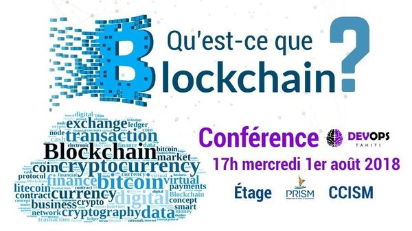
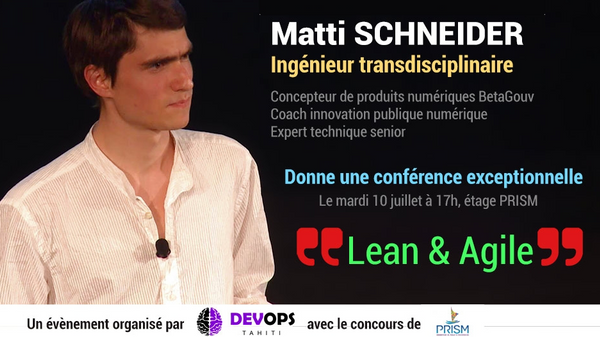

<!-- Section -->
<section>
    <header class="major">
        <h2>Nos valeurs</h2>
    </header>
    

        <article>
            
            

                <h3>La qualité</h3>
                
Toute la démarche consiste avant tout à répondre aux besoins de l'utilisateur. Tout le reste est ensuite question d'efficience. Nous gardons donc toujours en tête la question suivante: «en quoi est-ce que cela simplifie la vie de l'utilisateur de notre application ?».

            

        </article>
        <article>
            
            

                <h3>Le pragmatisme</h3>
                
Parce qu'il s'agit avant tout de produire, l'outil n'est que ça, un outil. Nous ne voulons donc pas utiliser une méthode de développement juste pour elle-même. Idem pour les librairies, frameworks, IDE et méthodes de gestion de projets (même si elles sont agiles).

            

        </article>
        <article>
            
            

                <h3>Intégration & livraison continue</h3>
                
Nous sommes (pour la plupart) intelligents mais faillibles. L'automatisation demande un travail de méta-réflexion. La machine exécutera tout ce qu'on lui demandera. À partir de ces trois axiomes, nous considérons l'intégration et la livraison comme des conditions nécessaires (mais non suffisantes) du devops.

            

        </article>
        <article>
            
            

                <h3>Data-driven decision</h3>
                
Le pilotage par la donnée a deux bénéfices immédiats: concevoir le produit en y intégrant les métriques de qualité et de performances et retirer l'ego de la prise de décision. Ouïne-Ouïne.

            

        </article>
    

</section>

<!-- Section -->
<section>
    <header class="major">
        <h2>Nos rencontres</h2>
    </header>
    

        <article>
            
            <h3>012 - L’UXD: quoi, pourquoi, comment</h3>
            <h4>Romain TARTIÈRE</h4>
            

                Cette conférence se focalise sur les aspects techniques du déploiement de services basés sur TLS.
                Nous verrons quelles menaces doivent être prises en compte et quels dispositifs nous permettent de nous en prémunir.
            

            

                <a href="https://romain.blogreen.org/files/tls-https-au-dela-du-certificat-x-509.pdf">Télécharger les slides</a>
            

            <ul class="actions">
                <li><a href="https://www.meetup.com/fr-FR/TahitiDevOps/events/265173633/" class="button">mercredi 9 octobre 2018</a></li>
            </ul>
        </article>
        <article>
            
            <h3>011 - L’UXD: quoi, pourquoi, comment</h3>
            <h4>Fabrice FAUCHON</h4>
            

                L’UXD (User eXperiment Design) est une méthode pluridisciplinaire, proactive, pragmatique, innovante, évolutive et perturbante visant à améliorer l'expérience des usagers d'un service web ou d'un produit selon 4 grandes étapes itératives : Empathie -> Définition -> Idéation -> Prototypage -> Test.
            

            <ul class="actions">
                <li><a href="https://www.meetup.com/fr-FR/TahitiDevOps/events/254659117/" class="button">mercredi 5 décembre 2018</a></li>
            </ul>
        </article>
        <article>
            
            <h3>010 - CKAN - La plateforme de l'Open Data</h3>
            <h4>Hubert LEVIEL</h4>
            

                CKAN est un catalogue de données open source. Il est le moteur des plus gros portails gouvernementaux d'Open Data (US, UK, Canada, Europe, France, Suisse...).
                La Polynésie française s'engageant actuellement sur la voie de l'Open Data, nous étudions la pertinence d'utiliser CKAN comme future plateforme.
                Rejoins-nous pour une exploration technique de son architecture et une démonstration de son API.
            

            <ul class="actions">
                <li><a href="https://www.meetup.com/fr-FR/TahitiDevOps/events/254654895/" class="button">mercredi 7 novembre 2018</a></li>
            </ul>
        </article>
        <article>
            
            <h3>009 - Kubernetes 101</h3>
            <h4>Jonathan PIGRÉE</h4>
            

                Pas de blabla, de la démo comme on l’aime, Jonathan nous fera passer de n00b à (presque) expert sur Kubernetes (k8s).
                Scalabilité, workload, canary deployment, le programme sera varié.

                <ul class="actions">
                    <li><a href="https://www.meetup.com/fr-FR/TahitiDevOps/events/253868192/" class="button">mercredi 5 septembre 2018</a></li>
                </ul>
            </article>
            <article>
                
                <h3>008 - Qu'est-ce que la blockchain ?</h3>
                <h4>Peter MEUEL</h4>
                
Cette session commencera par une comparaison des moyens de réduire l'incertitude dans les pratiques du cycle en V, du design et du Lean Startup. Après cette introduction qui permettra de fixer le vocabulaire et de faire émerger des questions, Matti animera une discussion collaborative au format fishbowl.

                <ul class="actions">
                    <li><a href="https://www.meetup.com/fr-FR/TahitiDevOps/events/253082119/" class="button">mercredi 1er août 2018</a></li>
                </ul>
            </article>
            <article>
                
                <h3>007 - Lean & Agile</h3>
                <h4>Matti SCHNEIDER</h4>
                
Cette session commencera par une comparaison des moyens de réduire l'incertitude dans les pratiques du cycle en V, du design et du Lean Startup. Après cette introduction qui permettra de fixer le vocabulaire et de faire émerger des questions, Matti animera une discussion collaborative au format fishbowl.

                <ul class="actions">
                    <li><a href="https://www.meetup.com/fr-FR/TahitiDevOps/events/252488402/" class="button">mardi 10 juillet 2018</a></li>
                </ul>
            </article>
            <article>
                
                <h3>006 - L’UXD: quoi, pourquoi, comment</h3>
                <h4>Fabrice FAUCHON</h4>
                
En étudiant le contexte, les utilisateurs et le contenu, on apporte une valeur ajoutée. On rend explicite un problème à résoudre, on bâtit une stratégie, on identifie les personas, on architecture l'information, on élabore des parcours utilisateurs, on prototype, on test... et on recommence ! L'UXD bouleverse l'entreprise et les méthodes de travail car comme dans l’agile et le DevOps, ceux qui travaillent sur le projet le pilotent, le lead est en bas de la pyramide, résolument orienté vers l'usager.

                <ul class="actions">
                    <li><a href="https://www.meetup.com/fr-FR/TahitiDevOps/events/248680227/" class="button">jeudi 5 avril 2018</a></li>
                </ul>
            </article>
            <article>
                
                <h3>005 - OpenPGP et réseau de confiance</h3>
                <h4>David PRÉVOT</h4>
                

                    Lors de ce meetup, David vous présentera: les concepts de OpenPGP (signature, chiffrement), les bonnes pratiques (date d’expiration, sous-clefs, stockage…), l'intérêt du réseau de confiance, les signatures de clefs, et l'accès au « strong set » (<a href="http://www.devops.pf/assets/pdfs/tdo_005.pdf">Slides de la présentation</a>).
                

                <ul class="actions">
                    <li><a href="https://www.meetup.com/fr-FR/TahitiDevOps/events/247046773/" class="button">lundi 12 février 2018</a></li>
                </ul>
            </article>
            <article>
                
                <h3>004 - Ce que j’aurai voulu savoir quand j’ai commencé</h3>
                <h4>Mickaël RUELLAN</h4>
                

                    Mickaël, de ATL Software (https://atl-software.net), fera un retour sur 10 ans d’expérience dans l’édition logicielle.
                

                <ul class="actions">
                    <li><a href="https://www.meetup.com/fr-FR/TahitiDevOps/events/245369905/" class="button">mercredi 06 décembre 2017</a></li>
                </ul>
            </article>
            <article>
                
                <h3>003 - Programmation fonctionnelle</h3>
                <h4>Peter MEUEL</h4>
                

                    Nous vous parlerons de programmation fonctionnelle: 
                    en quoi elle se différencie de la programmation impérative, procédurale et objet, 
                    et quand/où/pourquoi l'utiliser
                

                <ul class="actions">
                    <li><a href="https://www.meetup.com/fr-FR/TahitiDevOps/events/244675100/" class="button">mercredi 08 novembre 2017</a></li>
                </ul>
            </article>
            <article>
                
                <h3>002 - Docker: présentation et REx</h3>
                <h4>Léonard TAVAE</h4>
                
Léo nous fera une présentation de Docker, l'outil de containerisation, puis un retour d'expérience.

                <ul class="actions">
                    <li><a href="https://www.meetup.com/fr-FR/preview/TahitiDevOps/events/243268070" class="button">mercredi 04 octobre 2017</a></li>
                </ul>
            </article>
            <article>
                
                <h3>001 - DevOps 101</h3>
                <h4>Peter MEUEL & Léonard TAVAE</h4>
                
Présentation pour tout public, aucune question n'est idiote, et on sera ravi de répondre aux votres..

                <ul class="actions">
                    <li><a href="https://www.meetup.com/fr-FR/preview/TahitiDevOps/events/242980492" class="button">mercredi 06 septembre 2017</a></li>
                </ul>
            </article>
        

    </section>
